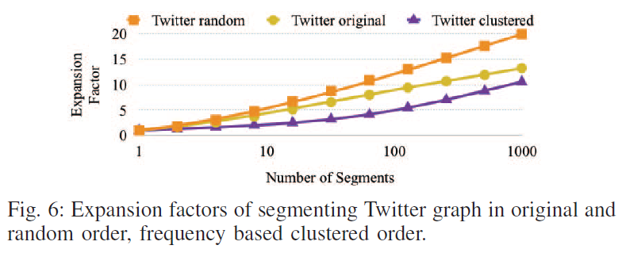
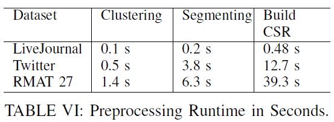

Making Caches Work for Graph Analytics
======================================

Zhang et al. IEEE BigData 2017.

キャッシュ効率の良いグラフ処理フレームワーク Cagra の提案

主なアイデア
-----------

### CSR Segmentation

-  キャッシュ効率が高まるように Compressed Sparse Row (CSR) 形式のグラフを分割する手法
- Pull 型の処理を前提として考える
    - 各エッジについて src 頂点のデータを dest 頂点に集約し dest 頂点のデータを更新する (例: PageRank)
- Dest 頂点について iterate し src 頂点のデータにアクセスすると, src 頂点に対するランダムアクセスが発生する (Fig. 2 (a))
    - エッジの情報はもともと連続アクセスで読み出されるので問題にしない
- そこで, src 頂点がキャッシュに収まる特定の範囲 (segment) 内となるように dest 頂点を仮想的に分割する (Fig. 2 (b))

- 分析処理時のループは外側から順に次の順で回す
    - Segment
    - Segment 内の頂点に接続された dest 頂点
    - Dest 頂点の隣接頂点のうち segment 内にある src 頂点
- これによりランダムアクセスされる src 頂点が特定の segment 範囲内となりキャッシュに当たる
- さらにバッファリングによって dest 頂点への書き込みを連続アクセスで行う (Fig. 4)
    - Dest 頂点の ID と部分的に集約された値のペアを一度バッファ領域に蓄積し, 全ての segment の処理を終えてから (cache-aware な方法で) 値をマージする
    - Fig. 2 で言えば segment 1 では v1 の値が, segment 2 では v2 の値が得られる. v1 と v2 の値をマージすることで元の頂点 v の値を得る.

 

- マージのコストはグラフの ordering と segment 分割数に依存する
- ある頂点の出エッジが N 個の segment に分割されると N 個の部分的な値が発生しマージのコストが増加する
- N の平均を expansion factor と呼ぶことにするとその値は Fig. 6 のとおり

### Frequency based clustering

- 要するに次数に基づく reordering
    - Clustering と言っているが密に接続されている頂点を固めるわけではない
- 頻繁に参照される頂点を co-locate することで空間的局所性が高まりキャッシュライン内のデータを有効活用できる
    > We use out-degrees to select the frequently accessed vertices because many graph algorithms use only pull based implementations, or spend a significant portion of the execution time in the pull phase.
- ただしここで co-locate するのは出次数が高い (:= 平均以上) 頂点のみとする
    > A third observation is that the original ordering of vertices in real world graphs often exhibit some locality. Vertices that are referenced together are sometimes placed close to each other due to existing communities.
    - **つまり original ordering の局所性が高いことを当て込んでいる**
- CSR Segmentation と組み合わせるときは先に frequency based clustering を行い, reordering 後のグラフを segmentation する

評価
----

### 他のグラフ処理フレームワークとの比較

- PageRank の他に Label Propagation と Betweenness Centrality で比較
- SD は Web グラフ
- Table II は前処理 (Frequency based clustering と CSR Segmentation) の時間を含まない

### 最適化の効果の確認

- Frequency based clustering 単体でも特に R-MAT グラフにおいて効果がみられる一方, real-world グラフにおいては効果が薄い

### 他のキャッシュ最適化手法との比較

- GridGraph および Hilbert Ordering と比較
    > Several researchers [16], [5] have proposed traversing graph edges along a Hilbert curve, creating locality in both the source vertex read from and the destination vertex written to.
    - [16] A.-J. Yzelman and D. Roose, “High-level strategies for parallel sharedmemory sparse matrix-vector multiplication,” Parallel and Distributed Systems, IEEE Transactions on, vol. 25, no. 1, pp. 116–125, Jan 2014. 
    - [5] F. McSherry, M. Isard, and D. G. Murray, “Scalability! but at what COST?” in 15th Workshop on Hot Topics in Operating Systems, HotOS XV, Kartause Ittingen, Switzerland, May 18-20, 2015, 2015.
- シングルスレッドでは Cagra と Hilbert ordering は同等
- しかし Hilbert ordering ではマルチスレッド時に頂点データの更新に並行性制御が必要になり性能に差が出る (Fig. 9)

### 前処理時間

- PageRank なら20イテレーション程度で償却できるので OK という主張

感想・疑問
---------

- アイデアはシンプル. CSR Segmentation と似たことを自分も検討していたが, 部分的な計算結果のマージにかかるコストが割に合わないのではないかと考えていた. 予想に反し丁寧な設計により高速化している.
- 手法が original ordering の局所性に依存している. Fig. 6 で使われている twitter グラフはもともと ordering によらず局所性が低いほうのグラフだったはず. それでこれだけ差がつくなら, 他のグラフで random ordering ならもっと増加するだろう.
    - 従って本来 Reordering 手法との組み合わせが必要な手法に見える. Original ordering は局所性が高いという主張だが, 必ずしもそうではないはず. SNS のソーシャルグラフがユーザ ID でソートされていたらコミュニティなど関係ないだろう.
- Frequency based clustering の後に CSR Segmentation という順番だと, 先頭の segment には高次数頂点が集中するが終端に近い segment はほぼ次数1のような状況になるのではないか？ Segmentation 後に reordering したほうが同一 segment 内でアクセス頻度に偏りが生じ, LLC にフィットするサイズの segment 内でも L1 や L2 を有効に利用できるのではないか？
